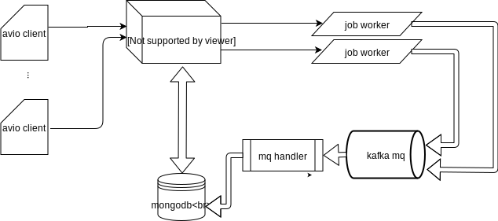

# avio server 开发文档

## 概述

avio server 目标为提供 avio 工具的后端服务人口，统一调度网络请求和耗时任务，预计将运行在 jjh-kubernetes 集群下，提供在 jjh 机房的内网服务。
为满足 avio 客户端的任务需求，avio server 端将对请求分为 task、job 两大类。前者负责较小的任务，server 端需要尽快给出响应；后者则耗时较长，需要为每个任务启动独立的进程来执行。在下一节[基础概念](#基础概念)中将详细介绍。

## 基础概念

如前所述，我们将 avio 客户端发送的请求分为两类来处理，分别是：

* task

  此类任务较轻，可以在一定较快时间内完成，如 `ls` ，此类操作需要服务端尽快给出响应，可在服务端进程中直接执行。

* job

  此类任务较重，运行时间可能长达数小时，甚至更长，如 `preload`、`save` 等，此类操作可以在用户提起请求后启动独立任务来执行，并将状态更新到数据库中，用户后续通过其他 API 查询此 job 的更新状态。

## 系统组件



如上图所示，avio server 端包含三大组件：

* service center: server 端对外的服务中心，提供给 avio 客户端的 Restful API，并负责调度 job executor；

* job executor: job 类型任务的执行模块，在执行过程中将运行状况发送给 mq；

* mq handler: 从 mq 中拉取消息并聚合出任务信息更新到数据库中，以供 service center 查询使用。

## API 接口

所有请求的 Host 为: `api.avio.ava-prd.kegate-jq.cloudappl`，除 `login` 之外的各接口鉴权方式为在 HEADER 中添加

``` HTTP
Authorization: QBox <auth_token>
```

### 实体类型列表

| 名称 | 说明 | 补充 | 状态 |
| :-- | -- | --- | --- |
| job(任务) | 见基础概念 | | WIP |

### 实体类型定义

#### 任务

* **任务定义**

```text
<JobSpec:object>
{
  "name": <string>,
  "uid": <number>,
  "type": <number>,
  "params": <JobParamsSpec:object>
}
```

\* type 的可选项为 0(ls)、1(preload)、2(save)、3(stat)

* **任务参数**

```text
<JobParamsSpec:object>
{
  "alluxioUri": <string>,     // fromFileList 为 true 时无效
  "depth": <number>,          // 可选，depth 为空时表示递归到所有
  "fromFileList": <boolean>
}
```

* **任务信息**

```text
<JobInfo:object>
{
  # include all fields from <JobSpec:object>
  "id": <string>,
  "status": <string>,
  "message": <string>,
  "createTime": <DateTime.RFC3339(Z08:00):string>,
  "updateTime": <DateTime.RFC3339(Z08:00):string>,
  "finishTime": <DateTime.RFC3339(Z08:00):string>,
}
```

### API 列表

| 名称  | 说明               | 补充             | 状态 |
|-------|--------------------|------------------|------|
| login | 登录接口           | 暂时可以先不考虑 | WIP  |
| jobs  | 操作已经创建的任务 |                  | WIP  |

### login

### jobs

* **创建任务**

请求

``` HTTP
POST /jobs
Content-Type: application/json

<JobSpec:object>
```

返回

``` HTTP
200 OK
Content-Type: application/json
{
    "name": <string>
}
```

* **列出任务**

请求

``` HTTP
GET /jobs?limit=<number>&skip=<number>&uid=<number>
```

返回

``` HTTP
200 OK
Content-Type: application/json
{
  "query": {
    "limit": <number>,
    "skip": <number>,
    "uid": <number>
  },
  items: [<JobInfo:object>, ...<JobInfo:object>],
  total: <number>
}
```

* **查看任务详情**

请求

``` HTTP

GET /jobs/<job_name>
X-UID:<number>

```

返回

``` HTTP

200 OK
Content-Type: application/json

<JobInfo:object>

```

* **更新任务详情**

请求

``` HTTP

PUT /jobs/<job_name>
X-UID: <number>
<JobInfo:object>

```

返回

``` HTTP

200 OK
Content-Type: application/json

<JobInfo:object>

```

* **删除任务**

请求

``` HTTP

DELETE /jobs/<job_name>
X-UID: <number>

```

返回

``` HTTP

200 OK
{}

```
